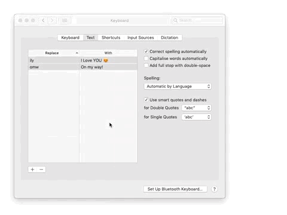

# markdown-it-emoji for macOS text replacements

Use this property lists to use the markdown-it-emoji phrases in your macOS keyboard.
If you sync your text replacements, you can also use them on iOS.

## Installation

1. Make a backup of your text replacements (see also: [Back up and share text replacements on Mac - Apple Support](https://support.apple.com/guide/mac-help/back-up-and-share-text-replacements-on-mac-mchl2a7bd795/mac "Back up and share text replacements on Mac - Apple Support"))
   <br/>
   
2. Download the `.plist` files to a convenient location
3. On your Mac, choose Apple menu  > System Preferences > Keyboard > Text
4. Drag the `.plist` files from its location to the Text pane
   <br/>
   
* It could be useful to turn off Correct spelling automatically

## Compiling the `.plist` files

You can recompile the files, if needed with the provided Python script.
To do so:

* Update `markdown_it_emoji.py` and `shortcuts.py`
* Run `create_plists.py` from within `plist_compiling/`

## Getting your own text replacements back (without having a backup)

You can remove the text replacements provided by this package by using the `isolate_custom_textreplacements.py` script.
Just export all your text replacements as in [Installation](#installation) and run the script with the exported file as an argument.
``` bash
./seperate_custom_textreplacements.py ~/Desktop/Text\ Substitutions.plist
```
You can also add a second arg to nicely dump the output into a file.
``` bash
./seperate_custom_textreplacements.py ~/Desktop/Text\ Substitutions.plist ~/Desktop/output.plist
```
